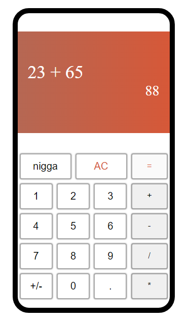

# Basic Calculator

### Description
A basic calculator that just adds, subtract, divides and multiples two input values.

### Limitations and/or functionalities
- The calculator can add two input values, the result of the operation can be used as one of the operands.

- The calculator is not programmed to work well with more than two input, thus the result from the following input would be `5` i.e `7 + 2 + 3 = 5`

- The calculator does not support:
    - Negative inputs
    - Calculation of percentages
    - Braces
    - Exponentials

### Implementation

The calculator makes use of global variables to track the operands, operator and a boolean to track if the result is to be used as the one operand.

The functions implemented in the calculator and what they do are as follow

- `clear()` resets all the global variables to the initial values and clears the DOM 
- `enable()` enables the equal and dot buttons, the buttons are disenabled when clicked to prevent multiple of it.
- `updateDom(value)` updates the DOM element with the parameter `value`. 
- `equal(sign, firstOp)` sets the secondOperand and class the respective operation based on the value of the arg `sign`.

- `handleOperator(sign)` sets the global var `operator` with the arg `sign` and also the `firstOperand`

### Deployment
A [live version](https://learode.github.io/calcu 'deployed calculator') of the calculator on github pages.

